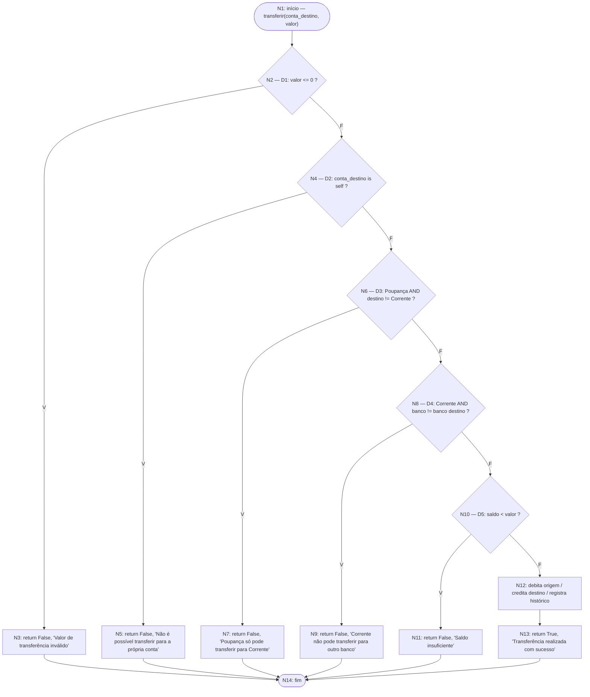

# Relatório — Testes de Técnica de Caixa Branca

**Disciplina:** Engenharia de Software III
**Atividade:** Testes de Técnica de Caixa Branca
**Versão do código analisado:** commit `c7ae92a` (branch `main`)

> Documento em elaboração. Seções 1-5 estão preenchidas a partir do
> planejamento estrutural do código. Seções 6-8 têm partes marcadas como
> `🔲 A PREENCHER`, que devem ser completadas depois que os testes forem
> implementados em `tests.py` e executados com `pytest --cov`.

## 1. Identificação da equipe e do projeto

- **Integrantes:** _(preencher nomes e matrículas)_
- **Projeto:** Mini sistema bancário (Pessoa, Banco, Conta)
- **Linguagem:** Python 3.12
- **Arquivo analisado:** [`models.py`](../models.py)
- **Classe / método analisado:** `Conta.transferir` (linhas 39-66)

## 2. Código selecionado e regra de negócio

`Conta.transferir(conta_destino, valor)` implementa a regra de transferência
entre contas do mini sistema bancário: valida o valor solicitado, impede
transferência para a própria conta, aplica as restrições específicas de
Conta Poupança (só pode enviar para Conta Corrente) e de Conta Corrente
(não pode enviar para outro banco), verifica saldo suficiente e, em caso
positivo, debita a origem e credita o destino.

```python
39: def transferir(self, conta_destino, valor):
40:     """Transfere `valor` desta conta para `conta_destino`. [...] """
47:     if valor <= 0:
48:         return False, "Valor de transferência inválido"
49:
50:     if conta_destino is self:
51:         return False, "Não é possível transferir para a própria conta"
52:
53:     if self.tipo_conta == Conta.TIPO_POUPANCA and conta_destino.tipo_conta != Conta.TIPO_CORRENTE:
54:         return False, "Conta Poupança só pode transferir para conta Corrente"
55:
56:     if self.tipo_conta == Conta.TIPO_CORRENTE and self.id_banco != conta_destino.id_banco:
57:         return False, "Conta Corrente não pode transferir para outro banco"
58:
59:     if self.saldo < valor:
60:         return False, "Saldo insuficiente"
61:
62:     self.saldo -= valor
63:     conta_destino.saldo += valor
64:     self.historico.append(f"Transferência de {valor:.2f} para conta {conta_destino.numero_conta}")
65:     conta_destino.historico.append(f"Recebimento de {valor:.2f} da conta {self.numero_conta}")
66:     return True, "Transferência realizada com sucesso"
```

**Entradas:** `conta_destino` (objeto `Conta`), `valor` (número).
**Saída:** tupla `(bool, str)` — sucesso/falha e mensagem.
**Retornos antecipados:** linhas 48, 51, 54, 57, 60 (todos os cenários de
rejeição). Não há exceções lançadas — cada bloqueio de regra de negócio é
comunicado via retorno, não via `raise`.

## 3. Grafo de Fluxo de Controle (GFC)



### Correspondência nó ↔ linha(s) do código

| Nó | Linha(s) | Tipo | Descrição |
|----|----------|------|-----------|
| N1 | 39 | Início | Entrada do método |
| N2 | 47 | Decisão (D1) | `valor <= 0` |
| N3 | 48 | Bloco / retorno | Valor inválido |
| N4 | 50 | Decisão (D2) | `conta_destino is self` |
| N5 | 51 | Bloco / retorno | Transferência para a própria conta |
| N6 | 53 | Decisão (D3) | Poupança → destino diferente de Corrente |
| N7 | 54 | Bloco / retorno | Poupança bloqueada |
| N8 | 56 | Decisão (D4) | Corrente → banco diferente |
| N9 | 57 | Bloco / retorno | Corrente bloqueada (banco diferente) |
| N10 | 59 | Decisão (D5) | `saldo < valor` |
| N11 | 60 | Bloco / retorno | Saldo insuficiente |
| N12 | 62-65 | Bloco sequencial | Débito, crédito e histórico |
| N13 | 66 | Bloco / retorno | Sucesso |
| N14 | — | Fim | Saída única (unificação dos retornos) |

### Arestas

N1→N2, N2→N3 (V), N2→N4 (F), N3→N14, N4→N5 (V), N4→N6 (F), N5→N14,
N6→N7 (V), N6→N8 (F), N7→N14, N8→N9 (V), N8→N10 (F), N9→N14,
N10→N11 (V), N10→N12 (F), N11→N14, N12→N13, N13→N14.

## 4. Complexidade ciclomática

| N (nós) | E (arestas) | P (componentes) | D (decisões) |
|---|---|---|---|
| 14 | 18 | 1 | 5 (D1 a D5) |

- **V(G) = E - N + 2P = 18 - 14 + 2(1) = 6**
- **V(G) = D + 1 = 5 + 1 = 6**
- **Resultado de ferramenta (Radon):** 🔲 A PREENCHER — rodar
  `radon cc models.py -s` e colar o resultado para `transferir`.

As decisões consideradas são as cinco estruturas `if` do método (linhas
47, 50, 53, 56, 59). As condições compostas com `and` das linhas 53 e 56
foram contabilizadas como **um único ponto de decisão cada** (é assim que
Radon e a maioria das ferramentas de complexidade ciclomática por
McCabe contam decisões simples; se a ferramenta usada pela dupla contar
cada operador `and`/`or` como uma decisão adicional, o valor pode
aparecer como 8 em vez de 6 — nesse caso, documentar a diferença aqui,
não ajustar o código para "forçar" a coincidência).

**Conclusão:** são necessários **6 caminhos básicos** e, no mínimo,
**6 casos de teste** para satisfazer o critério de caminhos. Casos
adicionais são necessários para cobrir condições compostas (ver seção 6).

## 5. Caminhos linearmente independentes

| Caminho | Sequência de nós | Cenário |
|---|---|---|
| P1 | N1-N2(V)-N3-N14 | Valor inválido |
| P2 | N1-N2(F)-N4(V)-N5-N14 | Transferência para a própria conta |
| P3 | N1-N2(F)-N4(F)-N6(V)-N7-N14 | Poupança → Poupança (bloqueada) |
| P4 | N1-N2(F)-N4(F)-N6(F)-N8(V)-N9-N14 | Corrente → outro banco (bloqueada) |
| P5 | N1-N2(F)-N4(F)-N6(F)-N8(F)-N10(V)-N11-N14 | Saldo insuficiente |
| P6 | N1-N2(F)-N4(F)-N6(F)-N8(F)-N10(F)-N12-N13-N14 | Transferência com sucesso |

Quantidade de caminhos (6) igual à complexidade ciclomática adotada (6).
Todos os seis são viáveis com combinações simples de entrada — nenhum
precisou ser substituído por inviabilidade.

## 6. Casos de teste e critérios atendidos

| ID | Entrada/cenário | Resultado esperado | Caminho | Critério |
|----|------------------|---------------------|---------|----------|
| CT-01 | valor ≤ 0 | `(False, "Valor de transferência inválido")` | P1 | Nós / arestas / caminho |
| CT-02 | destino = própria conta | `(False, "Não é possível transferir para a própria conta")` | P2 | Nós / arestas / caminho |
| CT-03 | Poupança → Poupança | `(False, "Conta Poupança só pode transferir para conta Corrente")` | P3 | Nós / arestas / caminho |
| CT-04 | Corrente → Corrente de outro banco | `(False, "Conta Corrente não pode transferir para outro banco")` | P4 | Nós / arestas / caminho |
| CT-05 | valor > saldo disponível | `(False, "Saldo insuficiente")` | P5 | Nós / arestas / caminho |
| CT-06 | Corrente → Corrente, mesmo banco, saldo suficiente | `(True, "Transferência realizada com sucesso")` | P6 | Nós / arestas / caminho |
| CT-07 | Poupança → Corrente, mesmo banco, saldo suficiente | `(True, "Transferência realizada com sucesso")` | equivalente a P6 | Condições compostas (D3 falso via combinação A=V/B=F) |
| CT-08 | Poupança → Corrente em outro banco, saldo suficiente | `(True, "Transferência realizada com sucesso")` | equivalente a P6 | Análise de requisito (ver observação abaixo) |

Os casos CT-01 a CT-06 esgotam os 6 caminhos básicos e, como consequência,
também cobrem todos os nós e todas as arestas do GFC (não há laço, então
não se aplica o critério "zero/uma/mais de uma iteração"). CT-07 é
necessário porque D3 é uma condição composta (`A and B`) e os caminhos
básicos, sozinhos, não exercitam a combinação A=Verdadeiro/B=Falso — só
A=Verdadeiro/B=Verdadeiro (P3) e A=Falso (P4, P5, P6).

**Observação sobre CT-08 / possível ambiguidade de requisito:** a regra de
negócio informada restringe transferências entre bancos diferentes apenas
para Conta Corrente (D4). Não há restrição equivalente para Conta
Poupança, então uma Poupança pode transferir para uma Corrente em outro
banco. Vale confirmar com o professor/enunciado original se esse
comportamento é intencional.

## 7. Execução, cobertura e análise dos resultados

🔲 A PREENCHER pela dupla após implementar `tests.py` e rodar:

```bash
pytest tests.py -v
pytest tests.py --cov=models --cov-branch --cov-report=html
radon cc models.py -s
```

Perguntas a responder nesta seção (ver enunciado da atividade):

1. Todos os testes passaram? Se não, qual falha e qual a causa?
2. Percentual de cobertura de linhas e de ramos obtido em `transferir`.
3. Todos os nós e arestas do GFC foram cobertos? (mostrar tabela CT ↔ nó/aresta)
4. Os 6 caminhos básicos foram exercitados?
5. Houve trecho inalcançável, caminho inviável, retorno antecipado ou exceção não coberta?
6. A ferramenta (Radon) calculou a mesma complexidade (6)? Se não, explicar a diferença (ver observação da seção 4 sobre contagem de `and`/`or`).
7. Os testes revelaram defeito, ambiguidade de requisito (ver CT-08) ou oportunidade de refatoração?

## 8. Conclusão e referências

🔲 A PREENCHER após a execução dos testes e análise da seção 7.

**Referências:** pytest, coverage.py / pytest-cov, Radon, Mermaid Live
Editor (usado para o GFC desta seção 3).
